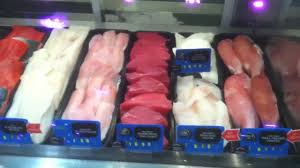

## Overview

I work in the Meat and Seafood department at Kroger and I am often responsible for giving customers fresh seafood upon their request. Although these products are labled, I still think it would be cool to train a CNN to classify different types of seafood.

## Obtaining Data

In order to collect the images to use as training data, I installed a chrome extension called Fatkun batch download image which allows you to download a whole page's worth of google images, about 400, at a time. For each class, type of fish in this case, I downloaded all the images available via google images, filtered out the less relevant images, nd put 80% in a test folder and 20% into a train folder. click on this link to view ad download the dataset via kaggle https://www.kaggle.com/spencerholley/seafood-images

## Training

After experimenting with different CNN architectures and hyperparameter combinations, I found the best results with 3 convolutional blocks each with 32 nodes and a relu activation function. Unfortunatley the best accuracy I could get was 65% with the original dataset. However I was able to increase accuracy to 72% by removing tilapia, cod, and catfish as they all look very similar and were very hard for the computer to classify.

## Future works

A great continuation of this project would be to use a pretrained model such as vgg19 rather than building my own. If the accuracy gets much better, it may be worthwhile to wrap the model into a web app.

## Mistakes 

This was my first machine learning project and there were many things I would do differently if I were to do this now!
1. Class Imbalance: each class had a different number of images, it is generally best practice for each class to have the same number of images unless you're doing outlier detection, cancer diagnosis for example
2. Written in a .py file: I was on an IDE kick at the time of this project, however it is better to use interactive notebooks, .ipynb, for projects like this because they allow you to showcase your thought process better as well as provide visuals which helps the reader understand what's going on as opposed to a wall of code.
3. Repetitive code: lines 15 - 60 are very repetitive and the tasks could of been completed with a small function
